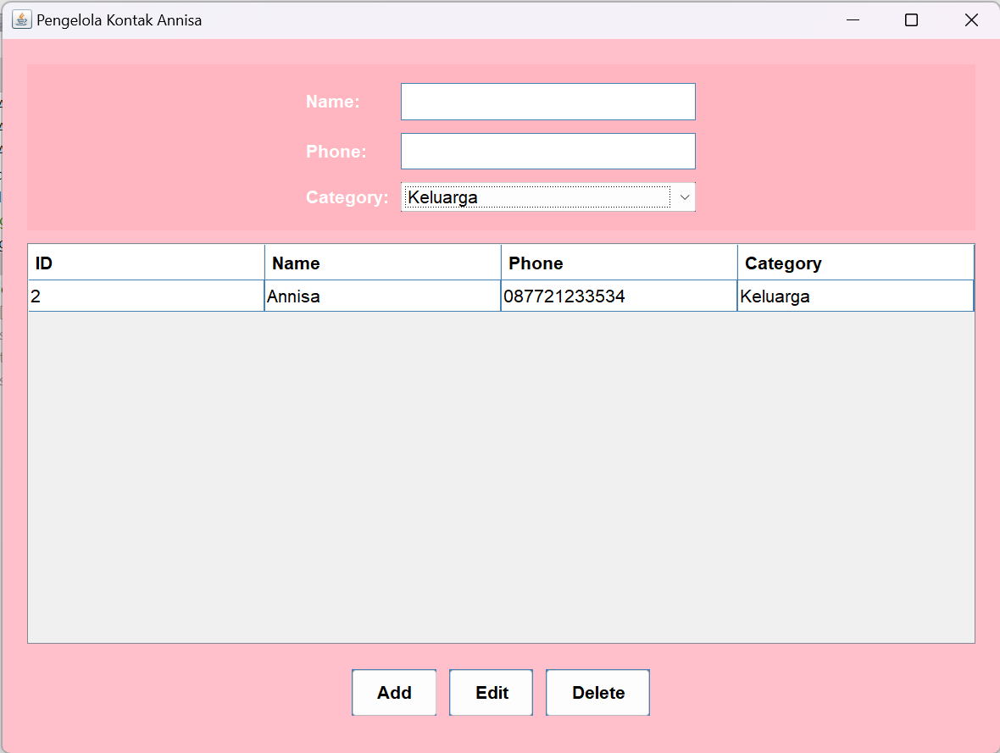

# PengelolaKontak
 Latihan 3 - Annisa (2210010581)
 
# Aplikasi Pengelola Kontak
 
Aplikasi Pengelola Kontak adalah Aplikasi untuk mengelola kontak ke database SQLite

# Keunggulan Aplikasi

- Pengelola Kontak: Aplikasi ini adalah untuk mengelola kontak

# Pembuat Aplikasi
 Annisa - 2210010581 - Latihan 3

# Fitur

Aplikasi ini menawarkan fitur:

Menambahkan Kontak serta mengedit dan menghapus

## Cara Menjalankan

1. Run File
2. Ketikkan Nama Yang Kita Input
3. Ketikkan Phone Yang Kita Input
4. Pilih kategori Yang Kita Input
5. Tekan Button Add maka akan muncul di panel ID, Name, Phone, dan category
6. Tekan Button Edit, jika ingin mengedit
7. Tekan Button Delete, jika Menghapus

# Demo

